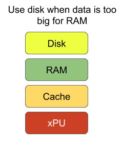
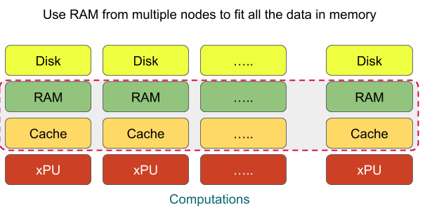

## What will you learn?

- When to use out-of-core computing vs. distributed computing solutions?
- Evaluating system requirements - memory, disk space, and cores
- Estimating compute costs
- Converting multiple CSV files to one HDF5 file
- EDA using Vaex
- EDA using Dask on a single node multi-core machine
- EDA using distributed Dask on a multi-node multi-core HPC cluster

## Pre-requisites


- Python 3.7
- Python Libraries: Numpy, Pandas, Vaex, Dask, Memory_profiler
- 50 GB free disk space 
- System with 2 cores + 8GB RAM

### Data

Download csv files from [medicare website](https://www.cms.gov/OpenPayments/Explore-the-Data/Dataset-Downloads)


Download 2019 and 2018 medicare data. 
```
wget https://download.cms.gov/openpayments/PGYR19_P063020.ZIP
wget https://download.cms.gov/openpayments/PGYR18_P063020.ZIP
```

Unzip both the files.
```
unzip PGYR19_P063020.ZIP
unzip PGYR18_P063020.ZIP
```

Once unzipped, you will see the following csv files
```
-rwxr-xr-x 1 ubuntu ubuntu 829K Jun 13 17:35 OP_REMOVED_DELETED_PGYR2018_P06302020.csv
-rwxr-xr-x 1 ubuntu ubuntu 955K Jun 13 17:35 OP_DTL_OWNRSHP_PGYR2019_P06302020.csv
-rwxr-xr-x 1 ubuntu ubuntu 1.5M Jun 13 17:35 OP_DTL_OWNRSHP_PGYR2018_P06302020.csv
-rwxr-xr-x 1 ubuntu ubuntu 504M Jun 13 17:43 OP_DTL_RSRCH_PGYR2018_P06302020.csv
-rwxr-xr-x 1 ubuntu ubuntu 493M Jun 13 17:44 OP_DTL_RSRCH_PGYR2019_P06302020.csv
-rwxr-xr-x 1 ubuntu ubuntu 6.0G Jun 13 19:00 OP_DTL_GNRL_PGYR2018_P06302020.csv
-rwxr-xr-x 1 ubuntu ubuntu 5.7G Jun 13 19:08 OP_DTL_GNRL_PGYR2019_P06302020.csv
```

## Problem Definition
Exploratory data analysis (EDA) using pandas on CSV files that are > 0.8 X RAM is NOT feasible or too slow to be practical. For example, EDA on a 6GB file on a machine with 8GB RAM using pandas fails.

## What is Exploratory Data Analysis (EDA)?

Summarize main characteristics of data often with visual methods

- Numerical
   - Interval
   - Ratio
- Categorical
   - Nominal
   - Ordinal

### Scatterplot


### Boxplot


## EDA requires column-based operations

### Out of core
When the data is too big for RAM use disk as temporary memory for random access 



### Distributed computing
Use a multi-node cluster with enough cumulative RAM to fit all the data in memory


